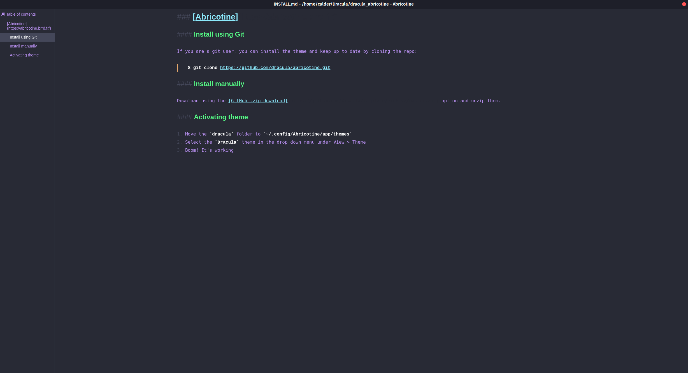

# Dracula for [Abricotine](https://abricotine.brrd.fr/)

> A dark theme for [Abricotine](https://abricotine.brrd.fr/).

## Install

All instructions can be found at [draculatheme.com/abricotine](https://draculatheme.com/abricotine).

## Team

This theme is maintained by the following person and a bunch of [awesome contributors](https://github.com/dracula/template/graphs/contributors).

 |
--- |
[Calder Sheagren](https://github.com/calderds) |

## License

[MIT License](./LICENSE)
